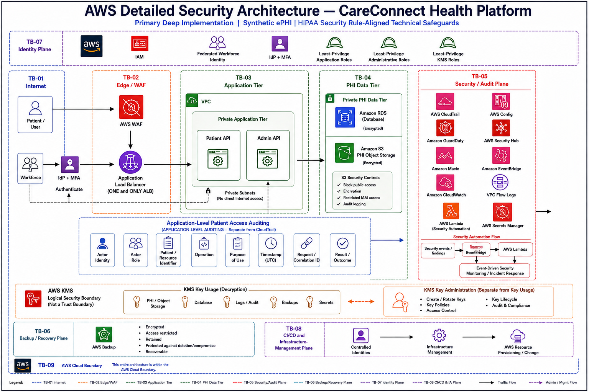
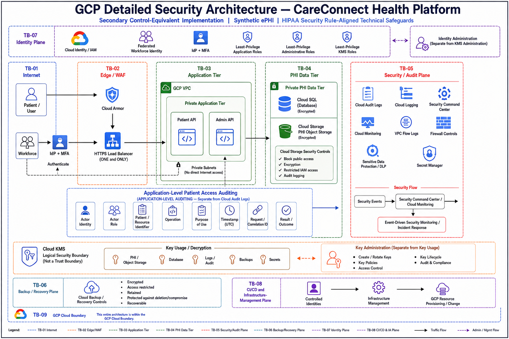
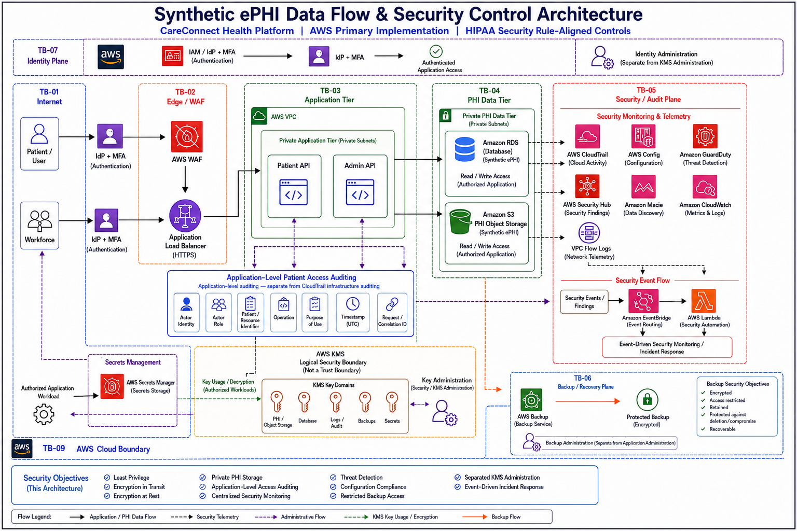
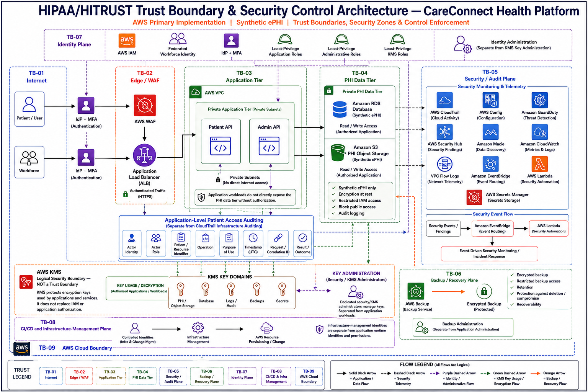
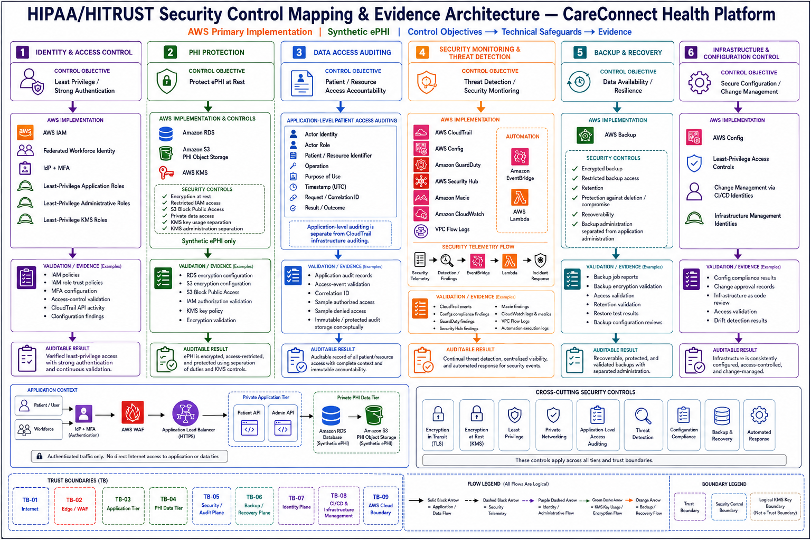

# HIPAA/HITRUST-Aligned Multi-Cloud Healthcare Security Engineering Platform

A production-style, portfolio-grade healthcare security engineering project demonstrating technical safeguards and security engineering practices for a synthetic ePHI healthcare workload across AWS and GCP.

> **Important:** This project does not claim HIPAA compliance, HIPAA certification, HITRUST certification, or any formal compliance attestation. It demonstrates technical architecture and implementation patterns aligned with selected HIPAA Security Rule objectives and informed by HITRUST CSF control objectives.

## Project Strategy

- **AWS** — primary deep implementation environment
- **GCP** — secondary control-equivalent implementation
- **Data** — synthetic ePHI only
- **Infrastructure** — Terraform
- **Validation** — AWS CLI / GCP CLI and cloud-console verification where useful
- **Evidence** — implementation, validation, failure, remediation, and teardown evidence
- **Design principle** — equivalent security objectives across clouds, not one-to-one service duplication

## Security Objectives

The platform is designed around the following security objectives:

- Strong workforce authentication and MFA
- Least-privilege human and workload identities
- Private application and data tiers
- Controlled internet ingress through edge security controls
- Restricted egress paths
- Encryption-domain separation using cloud KMS capabilities
- Dedicated secret-management boundaries
- Infrastructure and application-level auditability
- Configuration compliance and drift visibility
- Threat detection and security finding aggregation
- Synthetic ePHI discovery and exposure validation where justified
- Backup isolation and recovery assurance
- Incident-response orchestration readiness
- Cross-cloud blast-radius reduction

## Phase 1 — Healthcare Workload Design

**Status: Complete — merged to `main`**

Phase 1 established the approved design baseline before cloud implementation.

### Completed

- Healthcare workload architecture
- AWS primary security architecture
- GCP control-equivalent architecture
- Synthetic ePHI data classification
- ePHI data flows
- Trust boundaries
- Security requirements
- Threat model
- Architecture decisions
- HIPAA Security Rule-aligned technical control objectives
- HITRUST CSF-informed control mapping
- Initial technical risk register
- Controlled failure and attack scenario register
- Final architecture diagram set
- Project-level README

## Architecture Diagrams

### 01 — Multi-Cloud Healthcare Security Architecture


### 02 — AWS Detailed Security Architecture



### 03 — GCP Detailed Security Architecture



### 04 — Synthetic ePHI Data Flow and Security Controls



### 05 — Trust Boundary and Security Control Architecture



### 06 — HIPAA/HITRUST Security Control Mapping and Evidence Architecture



## Repository Structure

```text
.
├── attack-scenarios/
├── compliance/
├── diagrams/
│   ├── architecture/
│   ├── data-flow/
│   ├── trust-boundaries/
│   └── compliance/
├── docs/
│   ├── architecture/
│   ├── data-classification/
│   ├── data-flows/
│   ├── decisions/
│   ├── security-design/
│   └── threat-model/
├── evidence/
├── policies/
├── runbooks/
├── scripts/
├── templates/
├── terraform/
│   ├── aws/
│   └── gcp/
└── tests/
```

## Engineering Methodology

Every hands-on implementation phase follows the same evidence-driven lifecycle:

```text
CREATE
  ↓
TERRAFORM PLAN/APPLY
  ↓
TECHNICAL VALIDATION
  ↓
CONSOLE VALIDATION WHERE USEFUL
  ↓
EVIDENCE / SCREENSHOTS
  ↓
CONTROLLED FAILURE INJECTION
  ↓
TROUBLESHOOT / INVESTIGATE
  ↓
REMEDIATE / FIX
  ↓
REVALIDATE
  ↓
REMEDIATION EVIDENCE
  ↓
TERRAFORM DESTROY
  ↓
VERIFY RESOURCE REMOVAL
```

Controlled failure injection is used to demonstrate that security controls can be detected, investigated, remediated, and revalidated rather than only proving a successful deployment.

## AWS Control Direction

The AWS implementation is expected to cover control areas including:

- IAM and federated identity/MFA
- VPC and network segmentation
- ALB and AWS WAF
- Application compute
- RDS/database security
- S3 object-storage security
- AWS KMS encryption boundaries
- Secrets Manager
- CloudTrail
- CloudWatch and VPC Flow Logs
- AWS Config
- GuardDuty
- Security Hub
- Macie where justified
- EventBridge and response automation where justified
- AWS Backup

Not every service is deployed in every phase. Service selection is driven by the approved architecture, control objective, validation value, and cost constraints.

## GCP Control Direction

GCP demonstrates equivalent security objectives using cloud-native controls, including:

- Cloud IAM
- VPC and firewall controls
- HTTPS Load Balancing
- Cloud Armor
- Private application and database boundaries
- Cloud SQL
- Cloud Storage
- Cloud KMS
- Secret Manager
- Cloud Audit Logs
- Cloud Logging and Monitoring
- Security Command Center
- Sensitive Data Protection/DLP where justified
- Backup and recovery controls

GCP is intentionally not treated as an exact mirror of AWS.

## Cost Guardrails

The project is designed for short-lived, cost-conscious lab execution.

- Prefer free-tier eligible resources where practical
- Avoid unnecessary managed services
- Minimize resource count
- Avoid production-scale capacity for demonstration purposes
- Destroy infrastructure after evidence collection
- Verify resource removal after `terraform destroy`
- Evaluate cost versus security/evidence value before introducing a managed service

## Current Phase Roadmap

| Phase | Focus | Status |
|---|---|---|
| Phase 1 | Healthcare Workload Design | **Complete** |
| Phase 2 | AWS Security Foundation and Network Segmentation | **In Progress** |
| Phase 3 | AWS IAM and Workload Identity | Planned |
| Phase 4 | KMS Encryption Boundaries and Secrets | Planned |
| Phase 5 | Application Compute, ALB and WAF | Planned |
| Phase 6 | RDS and S3 Synthetic ePHI Data Plane | Planned |
| Phase 7 | Audit Logging, Config and Observability | Planned |
| Phase 8 | Threat Detection and Security Findings | Planned |
| Phase 9 | Backup and Recovery Isolation | Planned |
| Phase 10 | Incident Response and Automation | Planned |
| Phase 11 | GCP Control-Equivalent Implementation | Planned |
| Phase 12 | Cross-Cloud Attack Scenarios and Final Evidence | Planned |

## Compliance Positioning

This repository uses HIPAA Security Rule terminology and HITRUST CSF-informed control objectives as engineering reference points.

It is **not**:

- a HIPAA compliance assessment
- a HIPAA certification
- a HITRUST certification
- a legal or regulatory determination
- a substitute for an organizational risk assessment or formal audit

## Phase 1 Documentation

- [Healthcare Workload Architecture](docs/architecture/healthcare-workload-architecture.md)
- [Security Requirements](docs/security-design/security-requirements.md)
- [Healthcare Data Classification](docs/data-classification/healthcare-data-classification.md)
- [ePHI Data Flow](docs/data-flows/ephi-data-flow.md)
- [Architecture Decision Record](docs/decisions/ADR-001-healthcare-workload-scope.md)
- [Healthcare Threat Model](docs/threat-model/healthcare-threat-model.md)
- [Phase 1 Control Objectives](compliance/control-mapping/phase-01-control-objectives.md)
- [Phase 1 Risk Register](compliance/risk-assessments/phase-01-initial-risk-register.md)
- [Phase 1 Failure Scenario Register](attack-scenarios/phase-01-failure-scenario-register.md)

## Project Status

**Current state:** Phase 1 is complete and merged to `main`. Phase 2 — AWS Security Foundation and Network Segmentation — is now the active implementation phase.
